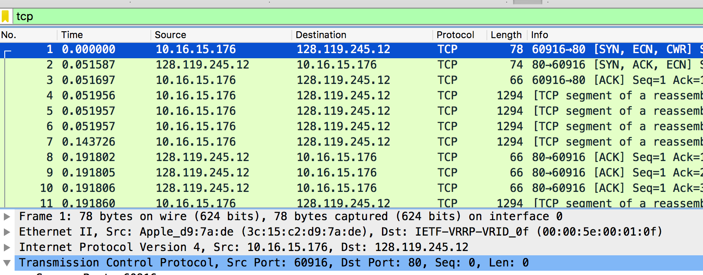

# CPS 706 Lab 3 Report: TCP

*Mitchell Mohorovich, 500563037*

## 2. First look at the captured trace

- **What is the IP address and TCP port number used by the client computer (source) that is transferring the file to gaia.cs.umass.edu?**

The IP address and TCP port number used by the client computer is `192.168.1.102`, and the port number used is `1161`.

- **What is the IP address of gaia.cs.umass.edu? On what port number is it sending and receiving TCP segments for this connection?**

The IP address of gaia.cs.umass.edu is `128.119.245.12`, it is sending and receiving TCP segments for this connection on port `80`.

- **What is the IP address and TCP port number used by your client computer (source) to transfer the file to gaia.cs.umass.edu?**

The IP address and TCP port used by my client computer is `10.16.15.176` and `60916`.

## 3. TCP basics

- **What is the sequence number of the TCP SYN segment that is used to initiate the TCP connection between the client computer and gaia.cs.umass.edu? What is it in the segment that identifies the segment as a SYN segment?**

The sequence number of the TCP SYN segment that is used to initiate the TCP connection between the client computer and gaia.cs.umass.edu is `0`. As shown in the screenshot below, the `SYN` bit flag is set in the segment to identify the segment as a SYN segment.

- **What is the sequence number of the SYNACK segment sent by gaia.cs.umass.edu to the client computer in reply to the SYN? What is the value of the ACKnowledgement field in the SYNACK segment? How did gaia.cs.umass.edu determine that value? What is it in the segment that identifies the segment as a SYNACK segment?**

The sequence number of the SYNACK segment sent by the server is `0`. The value of the ACK field in the segment is 1 as show in the screenshot below.

This value is determined by the sequence number provided by the initial SYN segment sent by the client.
The segment is identified as a SYNACK segment by having the SYN and ACK bit flags both set, as shown in the screenshot below.

- **What is the sequence number of the TCP segment containing the HTTP POST command?**

The sequence number of the TCP segment containing the HTTP POST command is `1`.

- **Consider the TCP segment containing the HTTP POST as the first segment in the TCP connection. What are the sequence numbers of the first six segments in the TCP connection (including the segment containing the HTTP POST)? At what time was each segment sent? When was the ACK for each segment received? Given the difference between when each TCP segment was sent, and when its acknowledgement was received, what is the RTT value for each of the six segments? What is the EstimatedRTT value after the receipt of each ACK? Assume that the value of the EstimatedRTT is equal to the measured RTT for the first segment, and then is computed using the EstimatedRTT equation on page 249 for all subsequent segments.**

The sequence numbers and send time of the first six segments in the TCP connection are as follows:

| Segment # | Seq # | Send Time | ACK received | RTT      | 
| --------- | ----- | --------- | ------------ | -------  |
| 1         | 1     | 0.026477  | 0.053937     | 0.027460 |
| 2         | 566   | 0.041737  | 0.077294     | 0.035557 | 
| 3         | 2026  | 0.054026  | 0.124085     | 0.070059 |
| 4         | 3486  | 0.054690  | 0.169118     | 0.114428 |
| 5         | 4946  | 0.077405  | 0.217299     | 0.139894 |
| 6         | 6406  | 0.078157  | 0.267802     | 0.189645 |

Using,
$$EstimatedRTT = 0.875 • EstimatedRTT + 0.125 • SampleRTT$$ from page 239 in the text for EstimatedRTT calculations.
$$EstimatedRTT_{1} = 0.027460$$

$$EstimatedRTT_{2} = 0.875 • EstimatedRTT_{1} + 0.125 • 0.035557 = 0.0285$$

$$EstimatedRTT_{3} = 0.875 • EstimatedRTT_{2} + 0.125 • 0.070059 = 0.0337$$

$$EstimatedRTT_{4} = 0.875 • EstimatedRTT_{3} + 0.125 • 0.114428 = 0.0438$$

$$EstimatedRTT_{5} = 0.875 • EstimatedRTT_{4} + 0.125 • 0.139894 = 0.0558$$

$$EstimatedRTT_{6} = 0.875 • EstimatedRTT_{5} + 0.125 • 0.189645 = 0.0725$$

- **What is the length of each of the first six TCP segments?**

The length of the first TCP segment is 565 bytes, the rest are 1460 bytes.

- **What is the minimum amount of available buffer space advertised at the received for the entire trace? Does the lack of receiver buffer space ever throttle the sender?**

The minimum amount of buffer space advertised for the entire trace is `5840` bytes, as shown in the SYNACK TCP segment. This window size grows to a maximum of `62780` thereafter. The receiver never throttles the sender due to lack of buffer space.

- **Are there any retransmitted segments in the trace file? What did you check for (in the trace) in order to answer this question?**

There are not any retransmitted segments in the trace file. I checked for duplicate ACK's which would trigger retransmission and could not find anything, after that used the filter `tcp && tcp.analysis.retransmission` to make sure there were not any duplicate TCP segment retransmissions, the filter returned no results.

- **How much data does the receiver typically acknowledge in an ACK? Can you identify cases where the receiver is ACKing every other received segment?**

The receiver typically acknowledges 1460 bytes of data. One case where the receiver ACKs every other received segment is ACK 87 and 88. The difference between the ACK numbers those two ACKs is (64005-61085) 2,920, and it skips over segment 83, which has the sequence number 61085.

- **What is the throughput (bytes transferred per unit time) for the TCP connection? Explain how you calculated this value.**

For this question, I will consider the throughput of the TCP connection in relation to the transfer speed of the POST request. I will be ignoring the TCP handshake as well as other segments not directly related to the POST request.

To calculate the throughput, I took the initial TCP segment of the POST request (#4 in the given Wireshark trace),`t = 0.026477` and `Seq = 1`, and the final TCP segment of the POST request (#197 in the given Wireshark trace), which had `t = 5.202024` and `Seq = 164041` and `Len = 272`.

Using $Th = D/ΔT$ Where Th is throughput, D is the amount of data transferred, and T is the time taken to do so.

Using the above equation:
$$Th = \frac{164041+272-1}{5.202024-0.026477}$$
$$Th = \frac{164311}{5.175547}$$
$$Th = 31747 bytes/second$$

## TCP congestion control in action

- **Use the Time-Sequence-Graph(Stevens) plotting tool to view the sequence number versus time plot of segments being sent from the client to the gaia.cs.umass.edu server. Can you identify where TCP’s slowstart phase begins and ends, and where congestion avoidance takes over? Comment on ways in which the measured data differs from the idealized behaviour of TCP that we’ve studied in the text.**

From the graph, the slowstart phase of the TCP connection begins at connection creation, and ends just at the first plateau which is just before 0.4 seconds. After 0.4 seconds, congestion avoidance takes over.

The measured packets are throttled a lot more than in the idealized behaviour studied in the textbook. The graph shows that the TCP connection timeout is not perfect as shown by the stepped graph, rather than the more gradual linear graph seen in the textbook.

In the graph shown below for my personal Wireshark trace, the slowstart phase begins at connection creation as well, but ends earlier at around 0.15 seconds.

Compared to the text, this graph shows that in reality, a TCP connection throughput can vary immensely based on the traffic provided. While the previous graph shows a linear albeit stepped graph, the graph below shows a more exponential shaped graph, with varying window sizes.

