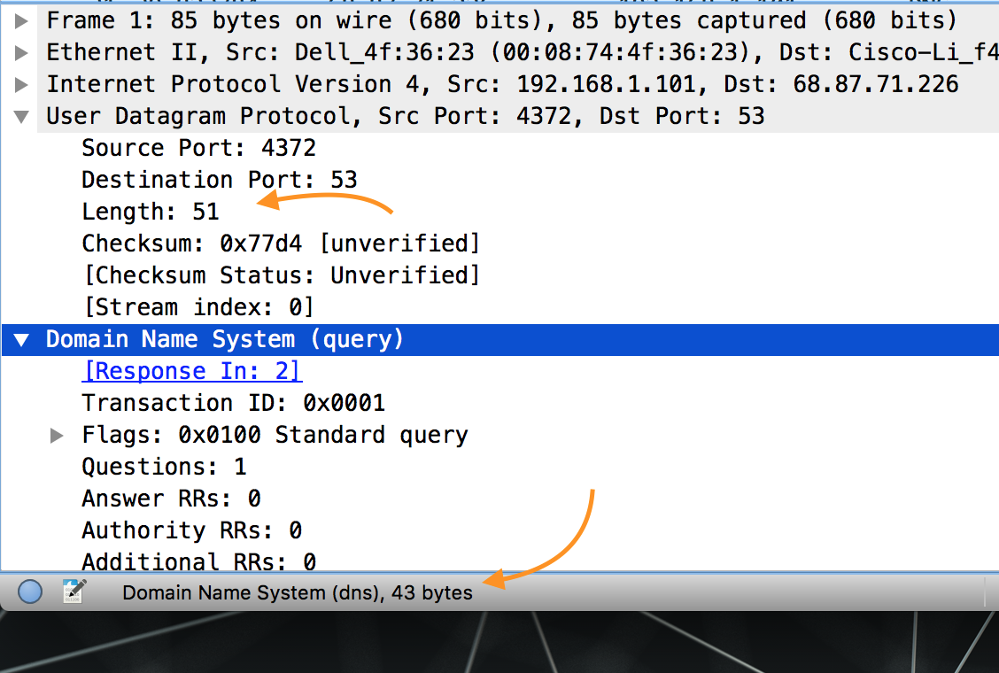
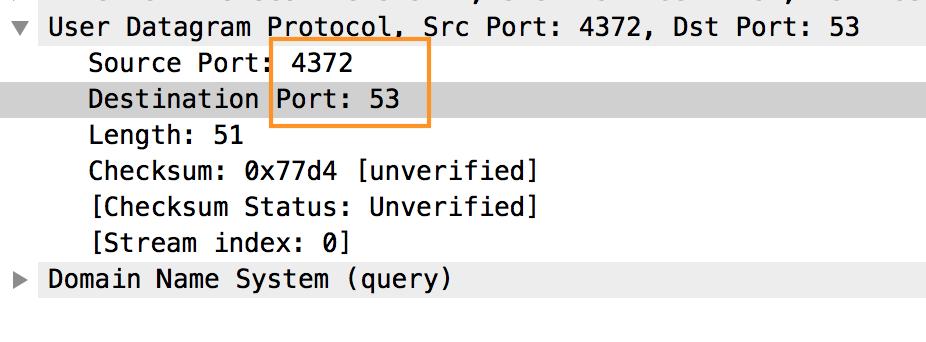
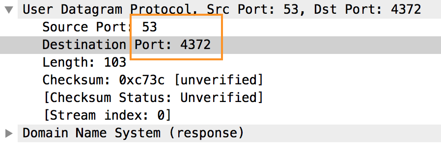
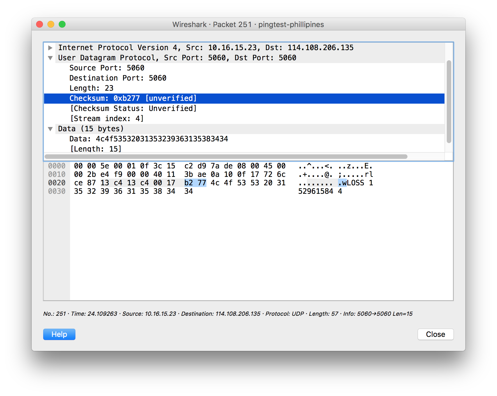

# CPS 706: Lab 4 - UDP
Mitchell Mohorovich, 500563037

## Assignment

For this lab, I used the given Wireshark trace to answer the assignment questions. For the extra credit question I used my own Wireshark trace.

**1. Select one packet. From this packet, determine how many fields there are in the UDP header. (Do not look in the textbook! Answer these questions directly from what you observe in the packet trace.) Name these fields.**

From looking at the packet in Wireshark, there are 4 fields in the UDP header, source port, destination port, length and the data check sum.

**2. From the packet content field, determine the length (in bytes) of each of the UDP header fields.**

Each of the UDP header fields are 2 bytes each.

**3. The value in the Length field is the length of what? Verify your claim with your captured UDP packet.**

The value in the Length field is the length of the UDP datagram header fields, plus the size of the payload. In the screenshot below, the Length header field is 51 bytes, and the size of the DNS payload data is 43 bytes, with 8 bytes remaining for the four 2-byte sized header fields.

\ 

**4. What is the maximum number of bytes that can be included in a UDP payload.**

Since the size of the UDP length header is 2-bytes, the maximum number it can hold is 65 535. Since 8 bytes are used by UDP itself, the maximum size of the payload is 65 535 - 8 = 65 527 bytes.

**5. What is the largest possible source port number?**

Since the size of both the source and destination port fields are 2-bytes each, the largest possible source port number is 65535, which is the largest number that 2-bytes can represent.

**6. What is the protocol number for UDP? Give your answer in both hexadecimal and decimal notation. (To answer this question, you’ll need to look into the IP header.)**

The protocol number for UDP is 0x11 in hexadecmial, and 17 in decimal.

**7. Search “UDP” in Google and determine the fields over which the UDP checksum is calculated.**

According to RFC 768, the checksum is as follows:

```
Checksum is the 16-bit one's complement of the one's complement sum of a
pseudo header of information from the IP header, the UDP header, and the
data,  padded  with zero octets  at the end (if  necessary)  to  make  a
multiple of two octets.
```

The "pseudoheader" comprises of the source IP, destination IP and protocol from the IP header data, and length header from the UDP datagram headers. This is added to the entire UDP datagram, which includes UDP header data (the checksum is 0's during calculation). Thus, all UDP headers are used in the calculation, the length header being used twice.

**8. Examine a pair of UDP packets in which the first packet is sent by your host and the second packet is a reply to the first packet. Describe the relationship between the port numbers in the two packets.**

In the screenshots below, the first screenshot shows the first packet being sent out from the host, the second is the response.

The port numbers between the two packets are reversed. When the host initially sends out the response, it attaches the source port so that the recipient knows where to respond. The recipient, knowing this sends its response to that given source port, as well as attaching its own source port.





## Extra Credit

**1. Capture a small UDP packet. Manually verify the checksum in this packet. Show all work and explain all steps.**

For this question, I ran a ping test at pingtest.com, which sends many UDP packets for packet loss measurement, each of which contain a small data payload. The length is odd, so for the very last byte of the payload, the byte is padded with a 0 byte on the right side, which is bolded in the table.

| Data Description                | Hex Data   |
| ------------------------------- | ---------- |
| Source IP, first half           | 0xA10      |
| Source IP, second half          | 0xF17      |
| Destination IP, first half      | 0x726C     |
| Destination IP, second half     | 0xCE87     |
| Protocol                        | 0x11       |
| UDP Length Header               | 0x17       |
| UDP Source Port                 | 0x13C4     |
| UDP Destination Port            | 0x13C4     |
| UDP Length Header               | 0x17       |
| Data Payload                    | 0x4C4F     |
| ...                             | 0x5353     |
| ...                             | 0x2031     |
| ...                             | 0x3532     |
| ...                             | 0x3936     |
| ...                             | 0x3135     |
| ...                             | 0x3834     |
| ...                             | 0x34**00**     |
| Sum                             | **0x34D85**|


This now 32-bit sum `0x34D85` is then split into two 16-bit halves: `0x4D85` and `0x3`. They are then added together to yield `0x4D88`, which is then 1's complimented to give the final checksum, `0xB266`, which matches what appears in the packet checksum below.

\ 
