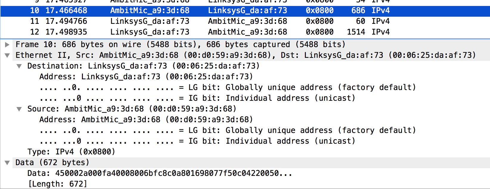
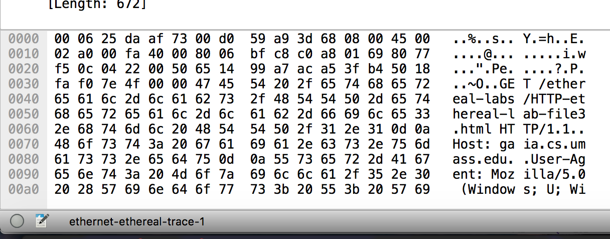
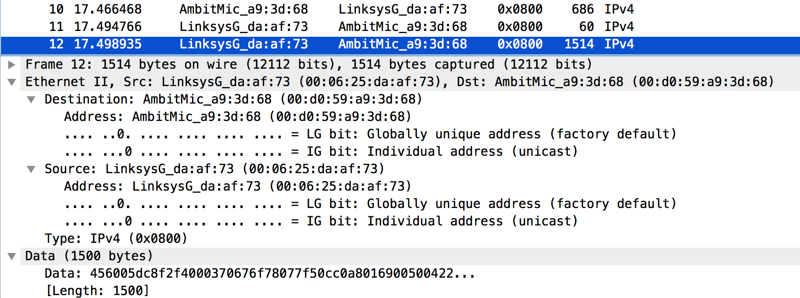
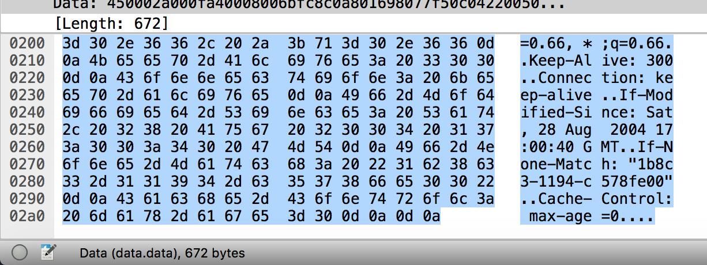
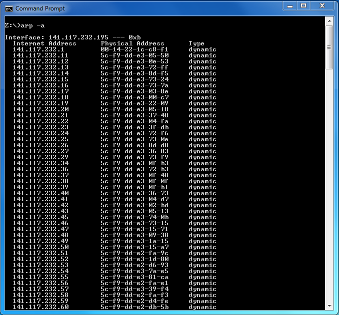
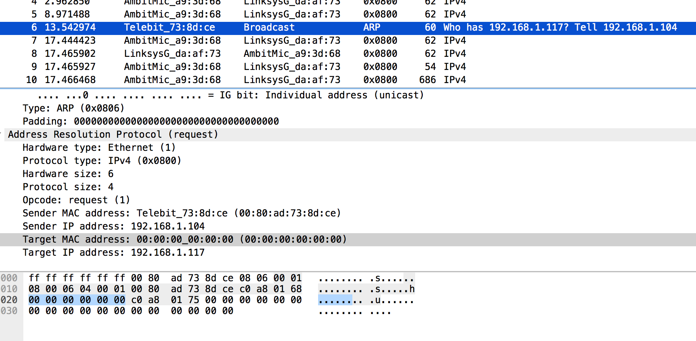

# CPS706 - Lab 6, Ethernet

Mitchell Mohorovich, 500563037

For this lab, the given wireshark trace provided in the lab file (ethernet-etheral-trace-1) was used.

## 1. Capturing and Analyzing Ethernet Frames

1. *What is the 48-bit Ethernet address of your computer?*
 
 The 48-bit Ethernet address of my computer is `00:d0:59:a9:3d:68`.
2. *What is the 48-bit destination address in the Ethernet frame? Is this the Ethernet
address of gaia.cs.umass.edu?*
 
 The 48-bit destination address of the Ethernet frame is `00:06:25:da:af:73`. This is the not the address of `gaia.cs.umass.edu`, it's the MAC address of the first hop router.
 
3. *Give the hexadecimal value for the two-byte Frame type field. What do the bit(s) whose value is 1 mean within the flag field?*

 The hexadecmial value for the two-byte Frame type field is `0x0800`. The bits whos value is 1 mean that the frame is over IPv4.
 
4. *How many bytes from the very start of the Ethernet frame does the ASCII “G” in “GET” appear in the Ethernet frame?*

 

 There are 54 bytes before the ASCII "G" in the Ethernet frame.
 
5. *What is the hexadecimal value of the CRC field in this Ethernet frame?*

 The value of the CRC field in the Ethernet frame is `0x0d0a0d0a`, located at the end of the data payload.
 
 
 
6. *What is the value of the Ethernet source address? Is this the address of your computer, or of gaia.cs.umass.edu? What device has this as its Ethernet address?*

 The value of the Ethernet source address is `00:06:25:da:af:73`. This is MAC address of the network gateway (first hop router).
 
7. *What is the destination address in the Ethernet frame? Is this the Ethernet address of your computer?*

 The destination address of the Ethernet frame is `00:d0:59:a9:3d:68`, this is the Ethernet address of my computer.
 
8. *Give the hexadecimal value for the two-byte Frame type field. What do the bit(s) whose value is 1 mean within the flag field?*

 The hexadecmial value for the two-byte Frame type field is `0x0800`. The bits whos value is 1 mean the frame is using IPv4.
 
9. *How many bytes from the very start of the Ethernet frame does the ASCII “O” in “OK” (i.e., the HTTP response code) appear in the Ethernet frame?*

 

 There are 67 bytes in the data payload before the ASCII "0" in "OK" appears. 
 
10. *What is the hexadecimal value of the CRC field in this Ethernet frame?*

 The hexadecimal value of the CRC field in this Ethernet frame is `0x3e0a0a3c`.
 
 ## 2. The Address Resolution Protocol
 
11. *Write down the contents of your computer’s ARP cache. What is the meaning of each column value?*

 

 The first column is the IP address of a particular machine, the second is the MAC address of the machine and the third is the ARP cache type, which is either static or dynamic.

12. *What are the hexadecimal values for the source and destination addresses in the Ethernet frame containing the ARP request message?*

 The source and destination addresses are `00:d0:59:a9:3d:68` and `ff:ff:ff:ff:ff:ff` respectively. 

13. *Give the hexadecimal value for the two-byte Ethernet Frame type field. What do the bit(s) whose value is 1 mean within the flag field?*

 The value `0x0806` for the two-byte Ethernet Frame type field means that this is an ARP message.
 

14. *Download the ARP specification from ftp://ftp.rfc-editor.org/in- notes/std/std37.txt. A readable, detailed discussion of ARP is also at http://www.erg.abdn.ac.uk/users/gorry/course/inet-pages/arp.html.*
  
  1. *How many bytes from the very beginning of the Ethernet frame does the ARP opcode field begin?*
  
     There are 6 bytes before the ARP opcode field. Two for hardware type, two for protocol type, one for HLEN and one for PLEN.
 
  2. *What is the value of the opcode field within the ARP-payload part of the Ethernet frame in which an ARP request is made?*

     The value of the opcode field within the ARP-payload part of the Ethernet frame is `0x0001`, representing the request operation.

  3. *Does the ARP message contain the IP address of the sender?*

      Yes the ARP message contains the IP address of the sender, in this case it is `192.168.1.105`.

  4. *Where in the ARP request does the “question” appear – the Ethernet address of the machine whose corresponding IP address is being queried?*

     The "question" appears in the target IP address field of the ARP request.

15. *Now find the ARP reply that was sent in response to the ARP request.*

  1. *How many bytes from the very beginning of the Ethernet frame does the ARP opcode field begin?*

     There are 20 bytes before the opcode field.
  
  2. *What is the value of the opcode field within the ARP-payload part of the Ethernet frame in which an ARP response is made?*

	  The value of the opcode field within the ARP-payload part of the Ethernet frame in which an ARP response is made is `0x0002`; reply.
  
  3. *Where in the ARP message does the “answer” to the earlier ARP request appear – the IP address of the machine having the Ethernet address whose corresponding IP address is being queried?*

     The "answer" to the earlier ARP request appears in the Target MAC address field.

  
16. *What are the hexadecimal values for the source and destination addresses in the Ethernet frame containing the ARP reply message?*

 The hexadecmial values for the source and destination addresses in the Ethernet frame containing the ARP reply message are: `00:06:25:da:af:73` and `00:d0:59:a9:3d:68` respectively.

17. *The first and second ARP packets in this trace correspond to an ARP request sent by the computer running Wireshark, and the ARP reply sent to the computer running Wireshark by the computer with the ARP-requested Ethernet address. But there is yet another computer on this network, as indiated by packet 6 – another ARP request. Why is there no ARP reply (sent in response to the ARP request in packet 6) in the packet trace?*

 There is not a response in the Wireshark packet trace because it is being sent from a different computer `192.168.1.104`, so its response will be sent to `192.168.1.104` and not `192.168.1.105`, which is the host machine.

